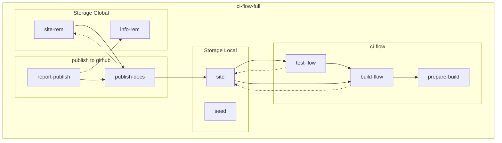

# Mermaid Flows Language

# CI-FULL-FLOW sample

```mermaid
flowchart 
    subgraph ci-flow-full
        subgraph Storage Local
        site
        seed
    end
        subgraph ci-flow-g[ci-flow]
            test-flow[test-flow]  --> 
            build-flow[build-flow] -->
            build-prepare-step[prepare-build]
            build-flow -.-> site
            test-flow -.-> site
        end

        subgraph publish-flow-g[publish to github]
            report-publish  -->
            publish-docs
        end

    subgraph Storage Global
        site-rem
        info-rem
    end
    site --> build-flow
    site --> test-flow
    end
    site-rem --> publish-docs --> site
    publish-docs -.-> site-rem
    report-publish -.-> info-rem
```